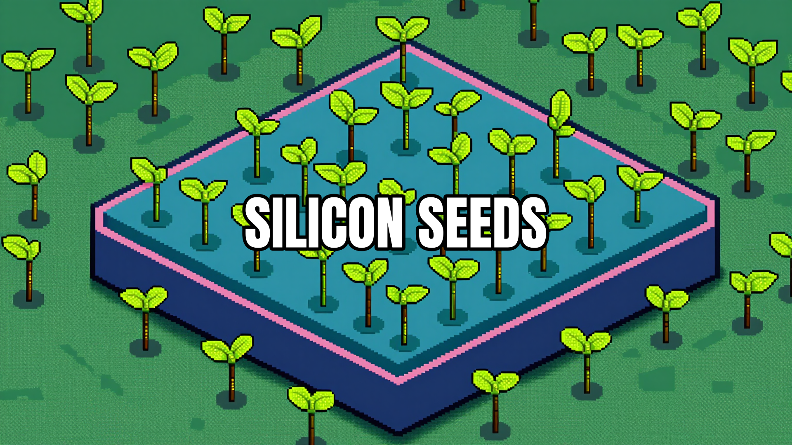
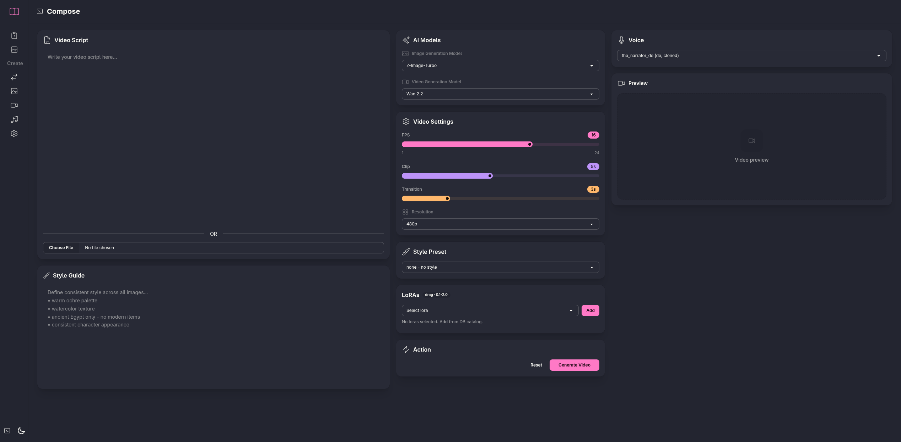
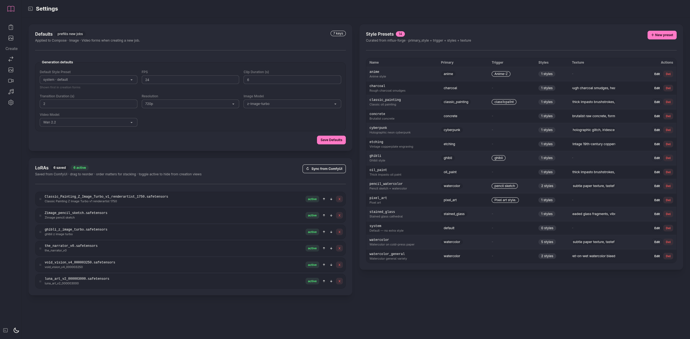
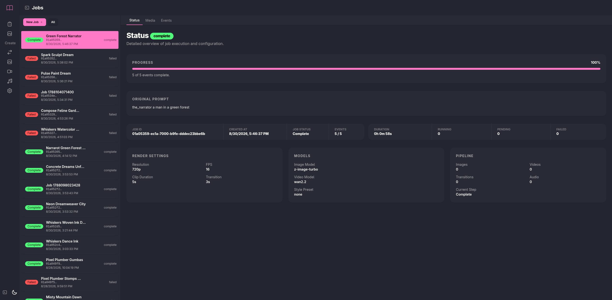
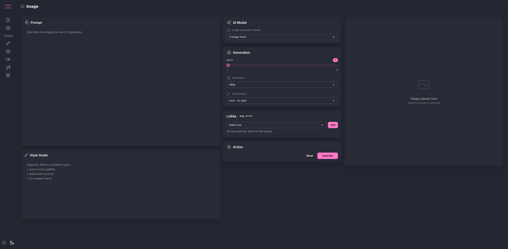
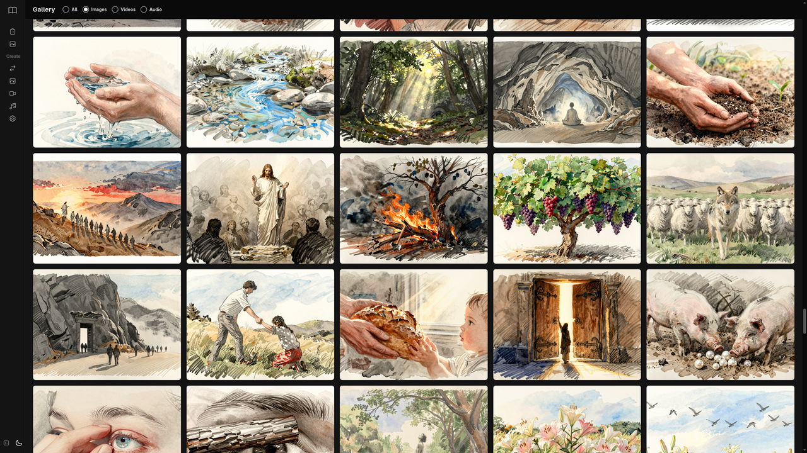
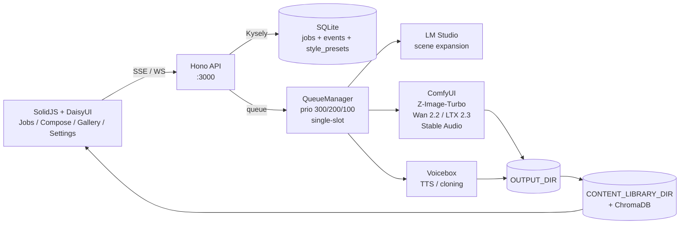

<p align="center">
  
</p>

<h1 align="center">Silicon Seeds</h1>

<p align="center">
  <em>Whoever has ears, let them hear.</em><br/>
  Local generative media studio - script to screen, fully offline, fully yours.
</p>

<p align="center">
  <a href="LICENSE"></a>
  =1.3" />
  
  
  
  
  
  
  
</p>

<p align="center">
  <a href="#-showcase">Showcase</a> •
  <a href="#-quick-start">Quick Start</a> •
  <a href="#-features">Features</a> •
  <a href="#-architecture">Architecture</a> •
  <a href="#-service-dependencies">Services</a> •
  <a href="#-testing">Testing</a> •
  <a href="#-troubleshooting">Troubleshooting</a>
</p>

---

> **License:** GPL-3.0-or-later - see [LICENSE](LICENSE). Any derivative or service that includes this code must remain open under the same license.

Local generative media studio. Orchestrates **LM Studio** (text), **ComfyUI** (image / video / audio), **SQLite + Kysely** (jobs), and a **SolidJS + DaisyUI** frontend to turn scripts into images, videos, and fully composed films. Queue is DB-backed, UI is SSE-driven, everything runs on your hardware.

---

## ✨ Showcase

<table>
<tr>
<td width="50%">

**Compose - script to film**

Script + style guide + voice + LoRAs → speech → scenes → images → videos → transitions → concat. End-to-end pipeline in one click.



</td>
<td width="50%">

**Settings - defaults, LoRAs, presets**

Defaults prefill new jobs. LoRAs synced from ComfyUI (drag to reorder, toggle active). 14 style presets curated from mflux-forge.



</td>
</tr>
<tr>
<td width="50%">

**Jobs - live SSE timeline**

Real-time job tracker with event stream, status tabs, and cancel / regenerate controls.



</td>
<td width="50%">

**Create Image - prompt to still**

Prompt + style preset + LoRA stack (0.1–2.0) + resolution. Z-Image-Turbo, 9 steps, instant preview.



</td>
</tr>
<tr>
<td colspan="2" align="center">

**Gallery - content library**

Persistent gallery backed by `CONTENT_LIBRARY_DIR` + ChromaDB vector search. Every generation archived, searchable, reusable.



</td>
</tr>
</table>

---

## 🛠️ Quick Start

### Installation

```bash
git clone https://github.com/DennisLoska/silicon-seeds.git
cd silicon-seeds
bun install
cp .env.example .env   # edit paths above
bun run db:migrate      # creates silicon-seeds.sqlite + style presets/loras tables
bun run build:css       # builds static/style.css from src/client/index.css
```

Validate setup:

```bash
bunx tsc --noEmit
curl http://127.0.0.1:8188/system_stats  # ComfyUI
curl http://127.0.0.1:1234/v1/models     # LM Studio API
curl http://127.0.0.1:17493/profiles     # Voicebox (if used)
```

### Running

```bash
# backend + frontend (hot reload)
bun run start:hot
# or without hot reload
bun run start
```

- Frontend (Vite dev, proxied): `http://127.0.0.1:5174` → API at `3000`
- Backend (Hono): `http://127.0.0.1:3000`
- Health: `curl http://localhost:3000/api/health` → `{"status":"up"}`

Production build (serves SPA from `dist/client`):

```bash
bun run build           # → dist/client (vite, outDir ../../dist/client from src/client)
bun run build:css       # → static/style.css
bun run start           # serves http://localhost:3000
```

Useful commands:

```bash
bun run test           # tsc --noEmit + eslint (no services needed)
bun run lint
bun run db:rollback      # last migration
bun run db:chroma        # start local Chroma (path from CONTENT_LIBRARY_DIR, port from CHROMADB_PORT)
```

---

## 🧪 Testing

```bash
bun run test      # typecheck (tsc --noEmit) + lint (eslint .) — no services needed
bun run test:e2e  # Playwright specs in e2e/ (jobs, settings, gallery, create-image/video/audio, text-to-video, compose)
```

`test:e2e` prereqs: app + **ComfyUI** (`http://127.0.0.1:8188`) + **LM Studio**
(`http://127.0.0.1:1234`, API server on with `LLM_MODEL` loaded) running.
Playwright boots the app itself (`bun run build && bun src/main.ts`,
baseURL `http://localhost:3000`, override via `PLAYWRIGHT_BASE_URL`).
Variants: `bun run test:e2e:headed`, `bun run test:e2e:ui`.

---

## 🚀 Features

| Area | What you get |
|------|--------------|
| **Compose** | Script (paste or `.txt`) + style guide + voice → full film: TTS (Voicebox) → LLM scene expansion → Z-Image-Turbo stills → Wan 2.2 / LTX 2.3 i2v + transitions → ffmpeg concat. Progress streamed via SSE/WS. |
| **Image** | Z-Image-Turbo text-to-image with style presets + optional LoRA chain (0–N, 0.1–2.0, ordered stacking). 480p / 720p / 1080p + 9:16 variants. |
| **Video** | Image-to-video and text-to-video via Wan 2.2 14B and LTX 2.3, including style transitions between scenes. |
| **Audio** | Text-to-instrumental / song via Stable Audio 3 Medium + ACE Step 1.5 XL. Single-slot queue, Voicebox voice cloning support. |
| **Jobs** | DB-backed queue (`prio 300 audio > 200 image > 100 video`), live SSE updates, per-event status, cancel & retry. Survives restarts via `failBrokenJobs`. |
| **Gallery** | Content library on disk (`CONTENT_LIBRARY_DIR`) with ChromaDB embeddings for semantic search. |
| **Settings** | Generation defaults (fps, clip/transition duration, resolution, models), LoRA manager (sync from ComfyUI, drag-reorder), style preset editor. |
| **Frontend** | SolidJS SPA + DaisyUI + Tailwind, Vite dev proxy, Hono API, WebSockets for ComfyUI queue events, SSE for job streams. |
| **Local-first** | No cloud. No API keys. Bring your own ComfyUI + LM Studio. Optional services degrade gracefully. |

---

## 🧭 Architecture



**Request flow:** `Create → POST /api/jobs/*` → DB `jobs` + `events` rows → `QueueManager.pump()` picks next event by priority → driver (LLM / ComfyUI / TTS) executes → writes artifact to `OUTPUT_DIR` → copies to `CONTENT_LIBRARY_DIR` → SSE pushes update → UI re-renders. ComfyUI progress arrives via WebSocket (`COMFYUI_BASE_WS`).

---

## 📋 Prerequisites

- **Bun** ≥1.3 (`curl -fsSL https://bun.sh/install | bash`)
- [**ComfyUI**](https://github.com/comfyanonymous/ComfyUI) running locally (default `http://127.0.0.1:8188`)
- [**LM Studio**](https://lmstudio.ai/) with API server enabled (default `http://127.0.0.1:1234`) and models loaded
- **ffmpeg + ffprobe** (`sudo pacman -S ffmpeg` / `brew install ffmpeg`)
- [**Voicebox**](https://github.com/JarodMica/voicebox) (optional, for TTS in Compose) - default `http://127.0.0.1:17493`
- **ChromaDB** (optional, for gallery search) - default `http://127.0.0.1:8000`

---

## 🔌 Service dependencies

| Service | Default URL | Required | What it does |
|---------|-------------|----------|--------------|
| [ComfyUI](https://github.com/comfyanonymous/ComfyUI) | `http://127.0.0.1:8188` | yes | Image (Z-Image-Turbo), video (Wan 2.2 / LTX 2.3), audio generation |
| [LM Studio](https://lmstudio.ai/) | `http://127.0.0.1:1234` | yes | LLM text, scene prompts, style expansion, job naming |
| [Voicebox](https://github.com/JarodMica/voicebox) | `http://127.0.0.1:17493` | for Compose | TTS for script → speech |
| ChromaDB | `http://127.0.0.1:8000` | no | Vector search for gallery |

If Voicebox / Chroma are not running, the app still starts - related features just fail at runtime with a clear error.

---

## ⚙️ Environment variables

Copy `.env.example` to `.env` and edit paths. All vars are read via `Bun.env`.

| Variable | Required | Default | Description |
|----------|----------|---------|-------------|
| `COMFYUI_BASE_URL` | yes | `http://127.0.0.1:8188` | ComfyUI HTTP API |
| `COMFYUI_BASE_WS` | yes | `ws://127.0.0.1:8188` | ComfyUI WebSocket for queue events |
| `OUTPUT_DIR` | yes | - | ComfyUI `output` dir (where Comfy writes images/videos) |
| `INPUT_DIR` | yes | - | ComfyUI `input` dir (where app stages uploads) |
| `CONTENT_LIBRARY_DIR` | yes | - | Persistent gallery dir (e.g. `~/content_library`) |
| `SCRIPTS_DIR` | no | `<CONTENT_LIBRARY_DIR>/scripts` | Where text-to-script saves generated `.md` files |
| `HOST` | no | `127.0.0.1` | Server bind host (set `0.0.0.0` only on trusted networks, app has no auth) |
| `PORT` | no | `3000` | Server bind port |
| `DB_PATH` | no | `data/silicon-seeds.sqlite` | SQLite file override |
| `LLM_MODEL` | yes | - | LM Studio model id, e.g. `qwen3.6-35b-a3b` |
| `EMBEDDING_MODEL` | yes | - | LM Studio embedding model, e.g. `text-embedding-qwen3-embedding-8b` |
| `VOICEBOX_URL` | no | `http://127.0.0.1:17493` | Voicebox TTS server |
| `CHROMADB_HOST` | no | `127.0.0.1` | Chroma host |
| `CHROMADB_PORT` | no | `8000` | Chroma port |
| `LOG_LEVEL` | no | `info` | `debug`/`info`/`warn`/`error` |
| `NODE_ENV` | no | `development` | `development` / `production` |

Example `.env`:

```bash
COMFYUI_BASE_URL=http://127.0.0.1:8188
COMFYUI_BASE_WS=ws://127.0.0.1:8188
OUTPUT_DIR=/path/to/comfy-ui/output
INPUT_DIR=/path/to/comfy-ui/input
CONTENT_LIBRARY_DIR=/home/you/content_library
SCRIPTS_DIR=/home/you/content_library/scripts
HOST=127.0.0.1
PORT=3000
LLM_MODEL=qwen3.6-35b-a3b
EMBEDDING_MODEL=text-embedding-qwen3-embedding-8b
VOICEBOX_URL=http://127.0.0.1:17493
CHROMADB_HOST=127.0.0.1
CHROMADB_PORT=8000
LOG_LEVEL=info
```

---

## 🎬 First run

1. Open `http://localhost:3000` → `Jobs`.
2. Go to `Settings` → `Sync from ComfyUI` to import LoRAs, edit `Defaults` (fps, resolution, preset) and `Style Presets` (from `mflux-forge`).
3. **Image:** `Create → Image` → prompt + style preset + optional LoRAs (drag to reorder, 0.1–2.0) → `Generate`.
4. **Compose:** `Create → Compose` → script or `.txt` + style guide + voice → `Generate Video`. Pipeline: speech → scenes → images → videos → transitions → concat.
5. **Gallery / Jobs:** track progress via SSE, view media, cancel or regenerate failed events.

API quick test:

```bash
curl -X POST http://localhost:3000/api/jobs/images \
  -F "prompt=a watercolor alpine lake" \
  -F "image_model=z-image-turbo" \
  -F "style_preset=watercolor" \
  -F "resolution=720p"
```

---

## 🧰 Tech Stack

| Layer | Choice | Why |
|-------|--------|-----|
| Runtime | **Bun** 1.3 | Native TS, fast startup, `Bun.env` + `Bun.file` |
| Frontend | **SolidJS** + **DaisyUI** + Tailwind | Fine-grained reactivity, no VDOM tax, themeable components |
| Realtime | **SSE** + **WebSockets** | SSE for job progress (one-way, reconnect-friendly), WS for ComfyUI queue |
| DB | **SQLite** + **Kysely** | Single file, zero ops, type-safe queries, migrations in `migrations/` |
| Image | **ComfyUI + Z-Image-Turbo** | 9-step turbo, CLIP `qwen_3_4b`, LoRA stacking |
| Video | **Wan 2.2 14B** / **LTX 2.3** | i2v + transition models, selectable per job |
| Audio | **Stable Audio 3** + **ACE Step 1.5** | Instrumental / song, Voicebox for TTS |
| LLM | **LM Studio** (Qwen 3) | Local OpenAI-compatible API, scene expansion |
| Search | **ChromaDB** | Embeddings (`text-embedding-qwen3-embedding-8b`) for gallery RAG |

---

## 🔧 Troubleshooting

- **ComfyUI not reachable** → check `COMFYUI_BASE_URL`/`WS`, `curl /system_stats`, ensure ComfyUI started with `--listen`.
- **LLM_MODEL missing** → `LLM_MODEL variable missing` at startup - set in `.env` and load model in LM Studio with API server on.
- **OUTPUT_DIR/INPUT_DIR wrong** → images not found, `Bun.file` errors - must be absolute paths to ComfyUI dirs.
- **Voicebox 8000 vs 17493** → default is now `17493`; set `VOICEBOX_URL` if yours differs.

---

## 📄 License

GPL-3.0-or-later. See [LICENSE](LICENSE).
